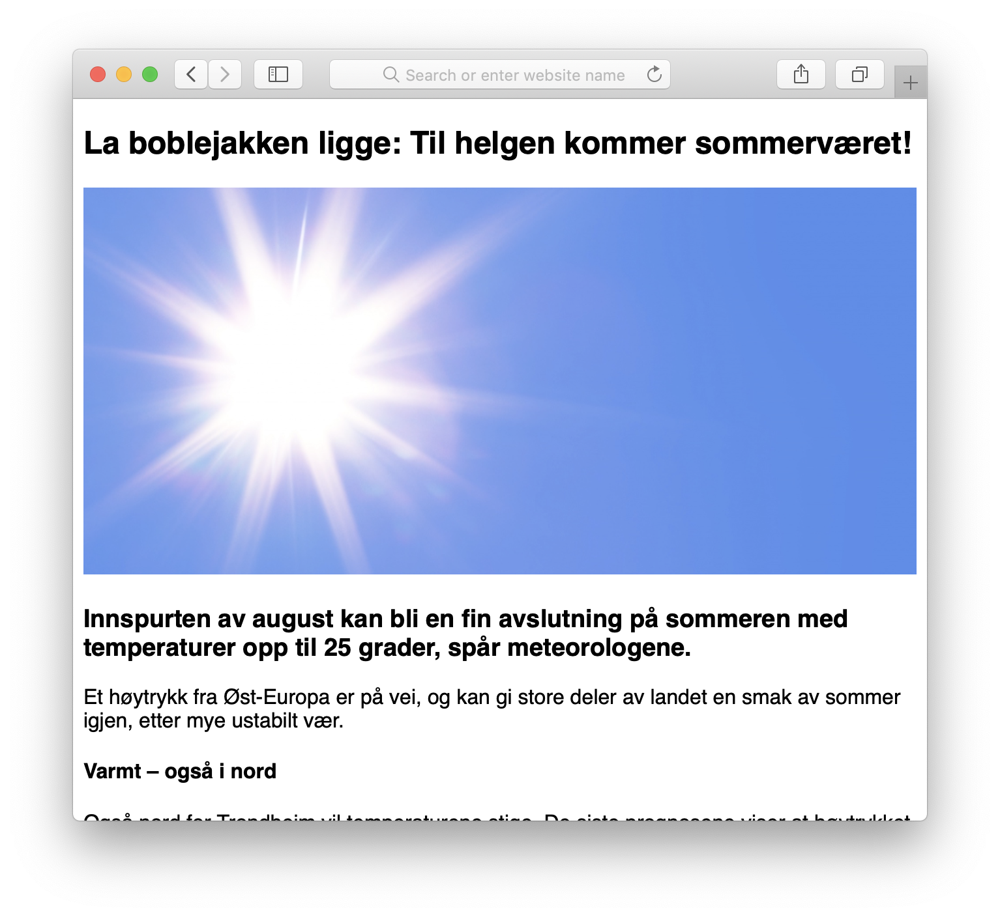

# Oppgave 1 (parprogrammering) - Style en artikkel i CSS
I denne oppgaven skal dere gjøre en layout mer stilig. Dere får utdelt HTML-kode og tekst til en artikkel, men uten noe som helst CSS styling. Deres oppgave er å få artikkelen til å se bedre ut. Hvis dere trenger inspirasjon kan dere se litt på hvordan nettaviser som VG og Dagbladet legger opp artiklene sine.

## Hvordan parprogrammere
Denne oppgaven skal løses sammen med en medelev gjennom parprogrammering, og dere skal gjøre et opptak av parprogrammeringen. Dette opptaket vil ikke bli sett av læreren, men skal i stedet brukes i forskningsøyemed. Læreren vil imidlertid få tilgang til kodefilene deres (men altså ikke videoopptaket).

### Instruksjoner:

1. Klikk på "Start assignment"
2. Klikk på "Invite" og inviter din medelev
3. Medeleven din kan nå åpne GitSpeak på sin egen maskin og bli med på parprogrammeringen
4. Klikk på "Record"
5. Løs oppgaven sammen (bruk maks 30 minutter)
6. Klikk på "Stop"
7. Klikk på "Deliver assignment"
8. Til slutt velger du hvilken lærer som skal vurdere kodefilene deres
